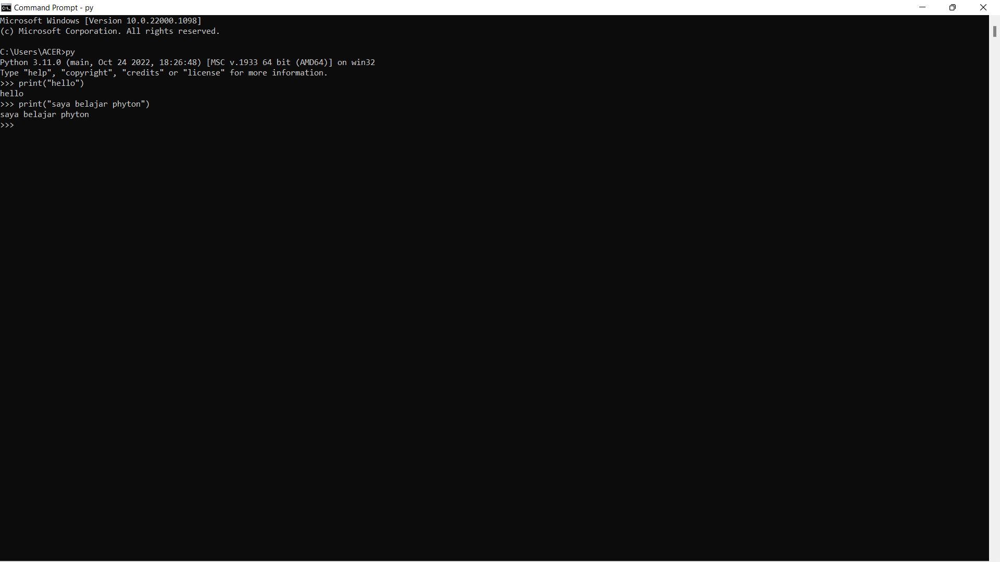
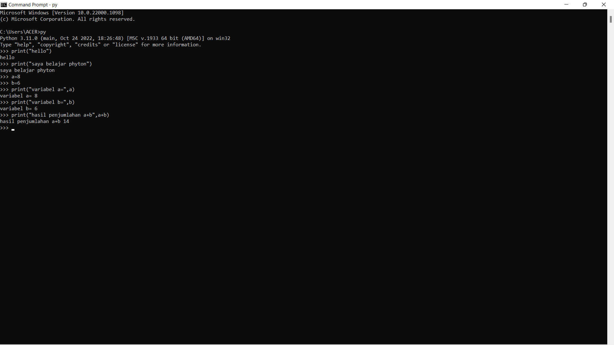
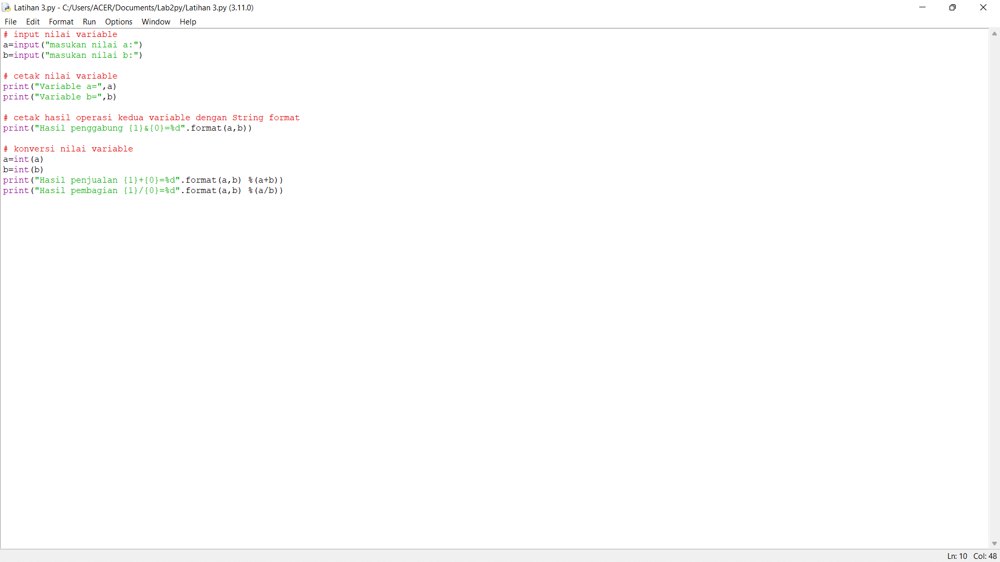
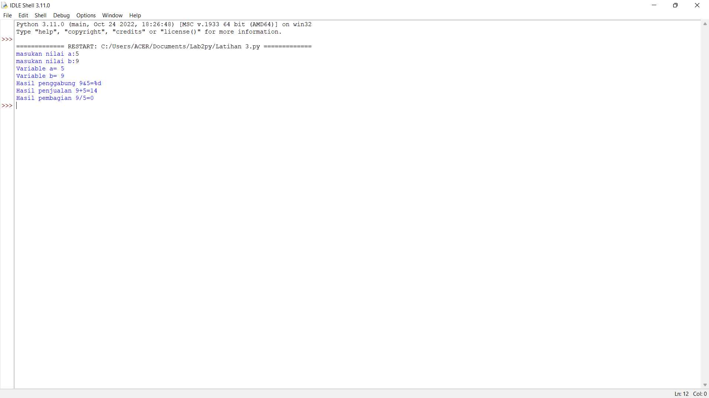
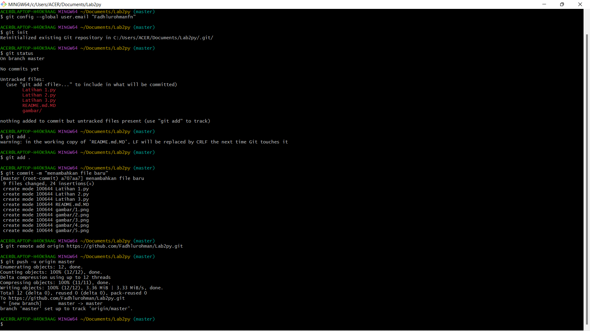

# Lab2py

garis Python console
1. pastikan Python sudah terinstal di laptop
2. buka CMD dengan cara klik windows + r lalu klik 'oke'

3. latihan 1 Python, "Hallo" dan "Saya sedang belajar Python"

4. latihan 2 Python, menjumlahkan dua buah bilangan menggunakan variabel a dan b

garis idle 
1. IDLE ini adalah editor teks bawaan Python yang sudah otomatis terinstal
2. garis IDLE
- membuat fungsi input untuk mengambil nilai variabel
- mencetak hasil inputan
- mencetak hasil inputan variabel dengan format string
- konversi nilai variabel

- hasil dari program

mengcommit file yang sudah dikerjakan ke github
1. langkahnya adalah sebagai berikut

